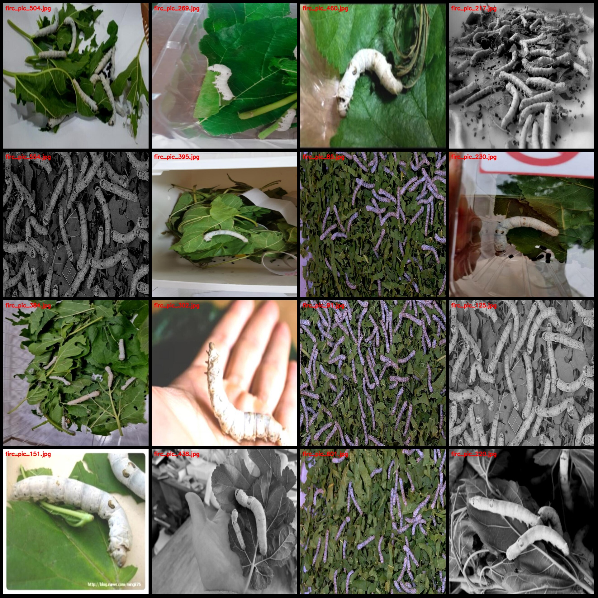
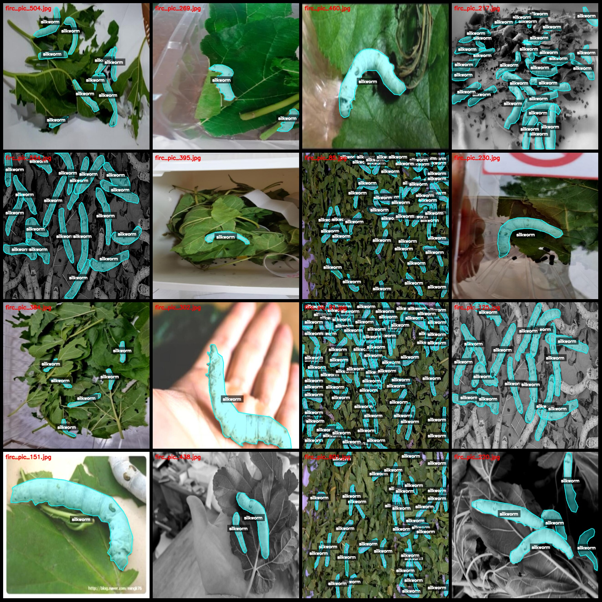
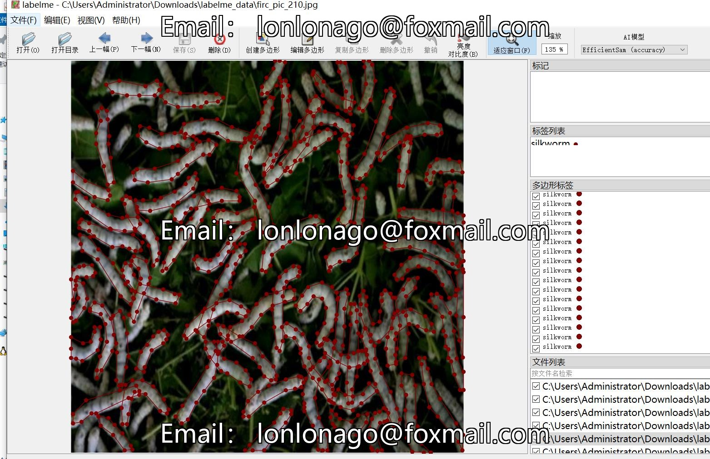

# LabelMe Dataset for Silkworm Identification and Segmentation

## Dataset Description
The dataset contains 615 images of silkworms, categorized as "silkworm". There are approximately 200 enhanced images that were added to the original dataset. The specifics of the enhanced images can 
be found in the image previews.

### Dataset Format:
The dataset is in labelme format (excluding mask files, just containing JPG images and corresponding JSON files).

### Image Counts:
- Number of JPG files: 615
- Number of JSON files: 615
- Number of categories: 1
- Category name: "silkworm"

Each category has a total of 8992 bounding box polygons.

### Labeling Tool:
- LabelMe version: 5.5.0

### Image Resolution:
- 640x640 pixels

### Labeling Rules:
- Polygons are drawn around the categories.

### Important Notes:
This dataset can be edited using the labelme software, but the JSON dataset must be converted into either a mask file or COCO format for instance segmentation or semantic segmentation.

### Special Disclaimer:
This dataset does not guarantee the accuracy of the trained models or weight files.

### Image Preview:

---

**Example of Annotation:**
Randomly selected 16 images from the dataset:

---

**LabelMe Editing Example:**

## Images

Here is a pay link on Stripe ( https://buy.stripe.com/3cs8yP7sY87d0vu9AB ). Please contact me lonlonago@foxmail.com after funding $89, and I will send you a complete data files , thank you!

